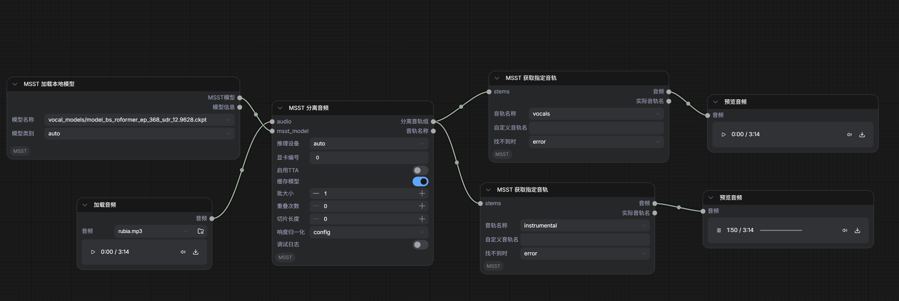

# Comfy-MSST

[中文说明](README.zh-CN.md)

Comfy-MSST packages the MSST-WEBUI inference runtime as ComfyUI custom nodes.
The plugin uses ComfyUI native `AUDIO` inputs and outputs, so MSST separation,
denoise, dereverb, de-echo, and restoration models can be inserted into normal
audio workflows.



## Source Layout

This plugin uses the extracted-source approach, not a Git submodule. The MSST
runtime files needed for inference are vendored in:

```text
custom_nodes/ComfyUI-MSST/msst_webui
```

This intentionally unlinks the plugin from upstream
`https://github.com/SUC-DriverOld/MSST-WebUI`, avoiding breakage from future
MSST-WEBUI API changes. To test against a separate MSST-WEBUI checkout, set:

```powershell
$env:COMFY_MSST_WEBUI_PATH="D:\path\to\MSST-WebUI"
```

## Model Layout

Model weights must be placed under the ComfyUI model directory:

```text
ComfyUI/models/MSST/pretrain
```

Expected subdirectories:

```text
ComfyUI/models/MSST/pretrain/vocal_models
ComfyUI/models/MSST/pretrain/multi_stem_models
ComfyUI/models/MSST/pretrain/single_stem_models
ComfyUI/models/MSST/pretrain/VR_Models
ComfyUI/models/MSST/SOME_weights
```

Catalog nodes read model metadata from `msst_webui/data_backup/models_info.json`
and resolve checkpoint paths into `ComfyUI/models/MSST/pretrain`. YAML configs
remain inside `msst_webui/configs_backup` and are copied to `msst_webui/configs`
at runtime if MSST needs the original layout.

You can override the model root with:

```powershell
$env:COMFY_MSST_MODEL_ROOT="D:\ComfyUI\models\MSST\pretrain"
```

The SOME vocal-to-MIDI tool uses a separate weight folder. Put the required
file here, keeping the filename unchanged:

```text
ComfyUI/models/MSST/SOME_weights/model_steps_64000_simplified.ckpt
```

You can override that folder with:

```powershell
$env:COMFY_MSST_SOME_WEIGHT_ROOT="D:\ComfyUI\models\MSST\SOME_weights"
```

## Official Model Recommendations

The following recommendation list is transcribed from the MSST official Feishu
wiki: `https://my.feishu.cn/wiki/Dy0bwG4XIizBgJkePDucILaMnlf`.

### MSST Models

| Model | Category | Stems | Size | Notes | Rating |
| --- | --- | --- | --- | --- | --- |
| `aufr33-jarredou_DrumSep_model_mdx23c_ep_141_sdr_10.8059.ckpt` | `multi_stem_models` | kick, snare, toms, hh, ride, crash | 417.38 MB | 用来细分提取出来的 drums | ⭐⭐⭐⭐ |
| `model_bandit_plus_dnr_sdr_11.47.chpt` | `multi_stem_models` | speech, music, effects | 141.99 MB | 可以提取带有背景音乐的说话声，以及特效音；提出来的说话声效果一般，但是能去掉特效音 | ⭐⭐⭐⭐ |
| `model_drumsep.th` | `multi_stem_models` | kick, snare, cybals, toms | 159.65 MB | 用来细分提取出来的 drums |  |
| `model_mdx23c_ep_168_sdr_7.0207.ckpt` | `multi_stem_models` | vocals, bass, drums, other | 427.36 MB | 提取多轨的 MDX23C |  |
| `scnet_checkpoint_musdb18.ckpt` | `multi_stem_models` | drums, bass, other, vocals | 40.47 MB |  |  |
| `HTDemucs4.th` | `multi_stem_models` | drums, bass, other, vocals | 80.24 MB | 提取多轨可以使用 | ⭐⭐⭐⭐ |
| `HTDemucs4_6stems.th` | `multi_stem_models` | drums, bass, other, vocals, guitar, piano | 52.45 MB | 提取多轨可以使用，拆的最多，一共 6 轨，最推荐 | ⭐⭐⭐⭐⭐ |
| `model_scnet_sdr_9.3244.ckpt` | `multi_stem_models` | drums, bass, other, vocals | 161.05 MB |  |  |
| `bs_roformer_4stems_ft.ckpt` | `multi_stem_models` | drums, bass, other, vocals | 502.82 MB | 微调后的 4 轨拆分 bs_roformer 模型 |  |
| `HTDemucs4_FT_bass.th` | `single_stem_models` | drums, bass, other, vocals | 80.24 MB | 输出结果中 bass 质量最高 |  |
| `HTDemucs4_FT_drums.th` | `single_stem_models` | drums, bass, other, vocals | 80.24 MB | 输出结果中 drums 质量最高 |  |
| `HTDemucs4_FT_other.th` | `single_stem_models` | drums, bass, other, vocals | 80.24 MB | 输出结果中 other 质量最高 |  |
| `HTDemucs4_FT_vocals_official.th` | `single_stem_models` | drums, bass, other, vocals | 80.24 MB | 输出结果中 vocals 质量最高 |  |
| `mel_band_roformer_crowd_aufr33_viperx_sdr_8.7144.ckpt` | `single_stem_models` | crowd, other | 870.8 MB | 此处的 crowd 指嘈杂声 |  |
| `model_bs_roformer_ep_937_sdr_10.5309.ckpt` | `single_stem_models` | other, vocals | 374.86 MB | 一般，但是比 UVR 好 | ⭐⭐⭐ |
| `deverb_mel_band_roformer_ep_27_sdr_10.4567.ckpt` | `single_stem_models` | noreverb, reverb | 466.9 MB | 去混响效果不如下面的 deverb_bs_roformer | ⭐⭐⭐⭐ |
| `deverb_bs_roformer_8_256dim_8depth.ckpt` | `single_stem_models` | noreverb, reverb | 162.86 MB | 去混响首选；也能去除部分和声；但是无法去延迟 | ⭐⭐⭐⭐⭐ |
| `deverb_bs_roformer_8_384dim_10depth.ckpt` | `single_stem_models` | noreverb, reverb | 344.75 MB | 比上面那个激进一点点，不过基本听不出差别 | ⭐⭐⭐⭐⭐ |
| `denoise_mel_band_roformer_aufr33_sdr_27.9959.ckpt` | `single_stem_models` | dry, other | 870.8 MB | 最新的降噪模型，推荐 | ⭐⭐⭐⭐⭐ |
| `denoise_mel_band_roformer_aufr33_aggr_sdr_27.9768.ckpt` | `single_stem_models` | dry, other | 870.8 MB | 比上面的降噪激进一点 | ⭐⭐⭐⭐⭐ |
| `dereverb_mdx23c_sdr_6.9096.ckpt` | `single_stem_models` | dry, other | 427.34 MB | 去混响，比 bs_roformer 那两个少激进得多 |  |
| `dereverb_mel_band_roformer_anvuew_sdr_19.1729.ckpt` | `single_stem_models` | noreverb, reverb | 870.81 MB | 分离混响推荐；不支持分离单声道混响 | ⭐⭐⭐⭐⭐ |
| `dereverb_mel_band_roformer_less_aggressive_anvuew_sdr_18.8050.ckpt` | `single_stem_models` | noreverb, reverb | 870.81 MB | 比上面那个少激进一点；不支持分离单声道混响 | ⭐⭐⭐⭐⭐ |
| `Apollo_LQ_MP3_restoration.ckpt` | `single_stem_models` | restored, addition | 63.46 MB | 用于修复 mp3 格式音频的音质，修复至 44.1kHz | ⭐⭐⭐⭐ |
| `aspiration_mel_band_roformer_sdr_18.9845.ckpt` | `single_stem_models` | aspiration, other | 797.26 MB | 气声分离模型，是气声不是呼吸声 | ⭐⭐⭐⭐ |
| `aspiration_mel_band_roformer_less_aggr_sdr_18.1201.ckpt` | `single_stem_models` | aspiration, other | 797.26 MB | 气声分离模型，比上面一个少激进，但效果会略差 | ⭐⭐⭐⭐ |
| `apollo_model_uni.ckpt` | `single_stem_models` | restored, addition | 140.06 MB | 针对人声的 apollo 音频修复模型，但实际效果一般 |  |
| `dereverb_echo_mbr_fused_0.5_v2_0.25_big_0.25_super.ckpt` | `single_stem_models` | dry, other | 434.66 MB | 同时去除混响和延迟的模型；效果略差于 anvuew 模型；不支持分离单声道混响 | ⭐⭐⭐⭐ |
| `de_big_reverb_mbr_ep_362.ckpt` | `single_stem_models` | dry, other | 434.66 MB | 去除大混响的模型，遇到大混响去除不了时可以尝试；不支持分离单声道混响 |  |
| `model_mdx23c_ep_271_l1_freq_72.2383.ckpt` | `single_stem_models` | similarity, difference | 417.34 MB | 中置声道提取，可以提取歌曲的 mid 和 side，实际用途不大 |  |
| `model_mel_band_roformer_ep_3005_sdr_11.4360.ckpt` | `vocal_models` | vocals, instrumental | 961.13 MB | 可以用来做微调训练的底模 | ⭐⭐⭐⭐ |
| `model_swin_upernet_ep_56_sdr_10.6703.ckpt` | `vocal_models` | vocals, instrumental | 896.36 MB | 第一次使用此模型会从 Hugging Face 下载预训练底模 |  |
| `model_vocals_htdemucs_sdr_8.78.ckpt` | `vocal_models` | vocals, instrumental | 160.34 MB |  |  |
| `model_vocals_mdx23c_sdr_10.17.ckpt` | `vocal_models` | vocals, instrumental | 427.34 MB | MDX23C 老人声提取模型，已经不如 bs_roformer | ⭐⭐⭐⭐ |
| `model_vocals_mel_band_roformer_sdr_8.42.ckpt` | `vocal_models` | vocals, instrumental | 128.67 MB |  |  |
| `model_vocals_segm_models_sdr_9.77.ckpt` | `vocal_models` | vocals, instrumental | 823.67 MB | 第一次使用此模型会从 Hugging Face 下载预训练底模 |  |
| `model_bs_roformer_ep_368_sdr_12.9628.ckpt` | `vocal_models` | vocals, instrumental | 609.7 MB | 分离人声伴奏推荐使用 | ⭐⭐⭐⭐⭐ |
| `model_bs_roformer_ep_317_sdr_12.9755.ckpt` | `vocal_models` | vocals, instrumental | 609.71 MB | 1297 提取出来的音频极高频有点问题，但是 SDR 值高，可以使用 | ⭐⭐⭐⭐⭐ |
| `model_mel_band_roformer_karaoke_aufr33_viperx_sdr_10.1956.ckpt` | `vocal_models` | karaoke, other | 870.8 MB | 分离和声模型；如果是原曲放进去，出来的就是带和声伴奏 | ⭐⭐⭐⭐⭐ |
| `Kim_MelBandRoformer.ckpt` | `vocal_models` | vocals, instrumental | 870.81 MB | Kim 的模型，效果比 1296 差一点，但是速度更快 | ⭐⭐⭐⭐⭐ |
| `big_beta5e.ckpt` | `vocal_models` | vocals, other | 1411.2 MB | 超级大模型，用于提取人声，处理速度和质量都不错，但人声存在少量噪声 | ⭐⭐⭐⭐⭐ |
| `bs_roformer_male_female_by_aufr33_sdr_7.2889.ckpt` | `vocal_models` | male, female | 502.7 MB | 用于分离男女声合唱，只能分合唱，间隔唱不行，效果一般，能用 |  |
| `BS-Roformer_LargeV1.ckpt` | `vocal_models` | vocals, other | 705.97 MB | 大模型，用于提取人声，处理速度和质量都不错，能比得上 bsr1296 | ⭐⭐⭐⭐⭐ |
| `inst_v1e.ckpt` | `vocal_models` | other, vocals | 870.8 MB | 针对提取伴奏训练的模型，出来的伴奏非常接近原版伴奏 | ⭐⭐⭐⭐⭐ |
| `kimmel_unwa_ft.ckpt` | `vocal_models` | vocals, other | 870.8 MB | Kim_MelBandRoformer 的微调模型，速度较快，分离表现不错 | ⭐⭐⭐⭐⭐ |
| `mel_band_roformer_instrumental_becruily.ckpt` | `vocal_models` | other, vocals | 870.81 MB | 针对提取伴奏训练的模型，伴奏 SDR 值和 1296 一样，但是推理速度更快 | ⭐⭐⭐⭐⭐ |
| `mel_band_roformer_vocals_becruily.ckpt` | `vocal_models` | other, vocals | 870.81 MB | 针对提取人声训练的模型，速度和质量都不错，但人声存在少量噪声 | ⭐⭐⭐⭐⭐ |
| `melband_roformer_inst_v2.ckpt` | `vocal_models` | other, vocals | 1501.54 MB | 超级大模型，如果 `inst_v1e` 不满意，可以尝试这个 v2 伴奏提取模型 | ⭐⭐⭐⭐⭐ |
| `melband_roformer_instvox_duality_v2.ckpt` | `vocal_models` | Vocals, Instrumental | 1639.48 MB | 平衡了人声和伴奏提取质量，并且处理速度较快，虽然模型最大 | ⭐⭐⭐⭐⭐ |

### VR Models

| Model | Primary Stem | Secondary Stem | Notes | Rating |
| --- | --- | --- | --- | --- |
| `1_HP-UVR.pth` | Instrumental | Vocals |  |  |
| `2_HP-UVR.pth` | Instrumental | Vocals |  |  |
| `3_HP-Vocal-UVR.pth` | Vocals | Instrumental |  |  |
| `4_HP-Vocal-UVR.pth` | Vocals | Instrumental | 用于提取人声/伴奏，但是不如上面的 bs_roformer 模型 | ⭐⭐ |
| `5_HP-Karaoke-UVR.pth` | Instrumental | Vocals | 去和声 | ⭐⭐⭐ |
| `6_HP-Karaoke-UVR.pth` | Instrumental | Vocals | 去和声，没有 5HP 激进 | ⭐⭐⭐ |
| `7_HP2-UVR.pth` | Instrumental | Vocals |  |  |
| `8_HP2-UVR.pth` | Instrumental | Vocals |  |  |
| `9_HP2-UVR.pth` | Instrumental | Vocals |  |  |
| `10_SP-UVR-2B-32000-1.pth` | Instrumental | Vocals |  |  |
| `11_SP-UVR-2B-32000-2.pth` | Instrumental | Vocals |  |  |
| `12_SP-UVR-3B-44100.pth` | Instrumental | Vocals |  |  |
| `13_SP-UVR-4B-44100-1.pth` | Instrumental | Vocals |  |  |
| `14_SP-UVR-4B-44100-2.pth` | Instrumental | Vocals |  |  |
| `15_SP-UVR-MID-44100-1.pth` | Instrumental | Vocals |  |  |
| `16_SP-UVR-MID-44100-2.pth` | Instrumental | Vocals |  |  |
| `17_HP-Wind_Inst-UVR.pth` | No Woodwinds | Woodwinds | 可以提取木管乐器 |  |
| `MGM_HIGHEND_v4.pth` | Instrumental | Vocals |  |  |
| `MGM_LOWEND_A_v4.pth` | Instrumental | Vocals |  |  |
| `MGM_LOWEND_B_v4.pth` | Instrumental | Vocals |  |  |
| `MGM_MAIN_v4.pth` | Instrumental | Vocals |  |  |
| `UVR-BVE-4B_SN-44100-1.pth` | Vocals | Instrumental | 去和声，但是 BVE 的 Vocals 和 Instrumental 是相反的，要注意；输出音频频率砍到了 18k | ⭐⭐⭐ |
| `UVR-De-Echo-Aggressive.pth` | No Echo | Echo | 去混响延迟，比 Normal 激进 | ⭐⭐⭐ |
| `UVR-DeEcho-DeReverb.pth` | No Reverb | Reverb | 去混响延迟，大混响用这个 | ⭐⭐⭐ |
| `UVR-De-Echo-Normal.pth` | No Echo | Echo | 去混响延迟，没 Aggressive 激进 | ⭐⭐⭐ |
| `UVR-DeNoise.pth` | Noise | No Noise | 降噪，不如上面的 MSST 模型 | ⭐⭐ |
| `UVR-DeNoise-Lite.pth` | Noise | No Noise | 降噪轻量版，更不行了 | ⭐ |
| `UVR-DeReverb-aufr33-jarredou_4band_v4_ms_fullband.pth` | Dry | Reverb | 新的去混响模型 | ⭐⭐⭐⭐ |
| `Harmonic_Noise_Separation_yxlllc.pth` | No Aspiration | Aspiration | yxlllc 大佬训练的气声分离模型，速度更快，效果更好 | ⭐⭐⭐⭐⭐ |

## Nodes

- `MSST Model From Catalog`: select a known MSST checkpoint from the model index.
- `MSST Model From Paths`: use a custom MSST checkpoint and YAML config.
- `MSST Separate Audio`: run MSST models for vocals, multi-stem separation,
  denoise, dereverb, aspiration removal, and Apollo restoration.
- `MSST VR Model From Catalog`: select a UVR/VR `.pth` model.
- `MSST VR Model From Path`: use a custom UVR/VR checkpoint.
- `MSST VR Separate Audio`: run VR models for vocals, denoise, dereverb,
  de-echo, and related two-stem tasks.
- `MSST Get Stem` / `MSST Get Common Stem`: extract one returned stem as native
  ComfyUI `AUDIO`.
- `MSST List Stems`: inspect available stem names.
- `MSST Ensemble Audio`: combine two to eight audio inputs with MSST ensemble
  algorithms.
- `MSST Subtract Audio`: subtract one audio stream from another.
- `MSST Preset Chain`: run an MSST-WEBUI preset JSON as an in-memory workflow.
- `MSST SOME Vocal to MIDI`: convert clean vocal audio into a MIDI file using
  the SOME tool.
- `MSST Clear Model Cache`: release cached separators and GPU memory.

## Typical Workflow

1. Native `Load Audio`
2. `MSST Model From Catalog` or `MSST VR Model From Catalog`
3. `MSST Separate Audio` or `MSST VR Separate Audio`
4. `MSST Get Stem`
5. Native `Save Audio`

Example workflow: [workflows/Separate_vocals.json](workflows/Separate_vocals.json)

## Dependency Notes

ComfyUI already owns the core stack: `torch`, `torchvision`, `torchaudio`,
`numpy>=1.25.0`, `transformers>=4.50.3`, `safetensors`, `pyyaml`, `scipy`,
`tqdm`, `psutil`, and `pydantic~=2.0`.

The original MSST-WEBUI requirements pin `transformers~=4.35.0`,
`librosa==0.9.2`, and `audiomentations==0.24.0`. Those are not used here:
`transformers~=4.35.0` conflicts with ComfyUI's `transformers>=4.50.3`, and
`audiomentations==0.24.0` requires `librosa<0.10.0`.

Comfy-MSST keeps `transformers>=4.50.3` and uses `librosa>=0.10.2`, which also
avoids the old `numpy` compatibility patch MSST-WEBUI documented for
`librosa 0.9.2`. The vendored Bandit package initializer is also trimmed for
inference, so training-only augmentation dependencies are not imported while
loading separation models.

Install only the supplemental dependencies from this plugin's
`requirements.txt` into the same Python environment that launches ComfyUI.

## License

ComfyUI-MSST is released under the GNU Affero General Public License v3.0.
See [LICENSE](LICENSE) for the full license text. The vendored MSST-WEBUI
runtime in `msst_webui` is also distributed under AGPL-3.0; keep its license
terms in mind when redistributing modified versions.
